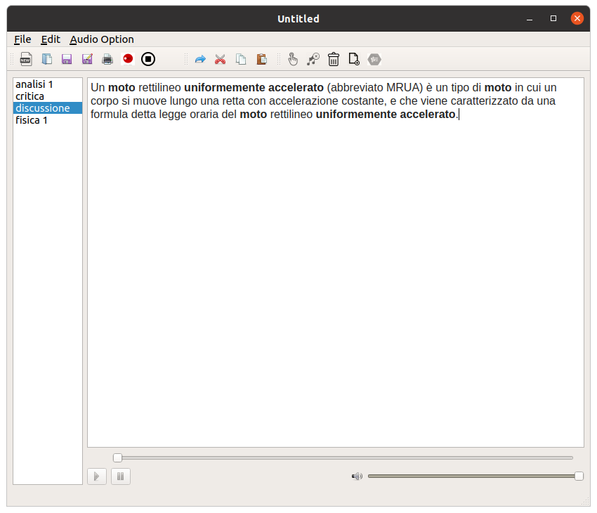

# Writernote
## Linux
<table>
<tr>
<td>


</td>
</tr>
</table>

## Features:
- Pen support
  - Zoom in and zoom on
  - Rubber size and type
  - Pen size option and type
  - Move object
  - Insert image
  - Enter text in pen mode
- Export file as PDF
- Print file
- Keyboard support
- Audio record [support for write mode only]:
  - Include audio file in writernote file
  - or decide to save the file in a specific location
  - listen to the audio again and visually see what was being written [only keyboard]


## Experimental Features:
- Import images
- Zoom in and Zoom on
- Personal sheet
- Rubber
- Android support
- Last open file
- Pen [different types of pen]
- Insert text into pen mode 

## To do
- Project .writer to image
- Convert audio to text
- Drag and drop image and file to import it
- Cloud
- Compile for IOS and mac
- Ask for classic confinement snapcraft

## Known bugs:
- Rubber
- Pen size [pen size is not yet supported]
- Playing an audio in pen mode is not dynamic but static
- Save image:
  - In pen mode, moving an image is not supported
  - In keyboard mode it is possible to add images, and move them, but when the file is closed the images will be deleted, as with linux systems [snapcraft], a temporary position of the file is created, which will be deleted when closed, in windows systems instead the image will be automatically added if and only if it is not moved to disk, as the html link inside the file remains


## Installing
  - Linux: 
    
    Install stable version [from snapd]
    ```bash
    sudo snap install writernote
    sudo snap connect writernote:audio-record
    ```

    Install unstable version [last]
    With multipass you can specify how many thread, ram, and disk, for the virtual machine for compilation.
    Personaly i use 20 thread, 24G ram, and 100G of disk.

    ```bash
    sudo snap install multipass 
    sudo snap install snapcraft --classic
    git clone https://github.com/giacomogroppi/writernote-qt.git
    cd writernote-qt
    multipass launch --name snapcraft-writernote --cpus 20 --mem 24G --disk 100G
    snapcraft

    sudo snap install writernote*.snap --devmode --dangerous
    sudo snap connect writernote:audio-record
    ```

  - Windows:
    [here](https://github.com/giacomogroppi/writernote-qt/releases) you can find all the version for windows.

## Compiling
  - Linux:
    dependence:
      it's raccomend to download qt creator, with all the component, from the official website.
      in case you can install all the dependence by install all the package from build-packages and the stage-packages in snapcraft.yaml [writernote]

    compile:
      ```
        mkdir build
        qmake writernote.pro
        make -j $nproc
      ```
  - Windows:
    dependence:
      mingw:
      ```
        pacman -S git
        git clone https://github.com/giacomogroppi/writernote-qt.git
        ./windows/dipendenze.sh
        ./windows/compile.sh
      ```
      power Shell: [to create an installation file]
      ```
        cd windows
        .\package.bat
      ```
  - Android:
    In /android you can find all the rule to compile writernote for android.
    It's an experimental project and a lot of things don't work for android.

## File format

The _.writer format is a compressed archive, in which a file `` indice.xml '' can be found, in which all the notebooks and all the audio are saved, whether they are recorded, or whether they are imported by the application.

When the file is open, only the indice.xml and the file of the copybook is loaded.


## Development
The application is entirely developed by Giacomo Groppi.
For developing new features, write a Ticket, so others know what you are doing. For development create a fork, and use the test as base. Create a Pull request for each fix. Do not create big pull requests, as long as you don't break anything features also can be merged, even if they are not 100% finished.. To report a problem send an email to the same address [possible with the error log and/or with a photo].

See [GitHub:writernote](http://github.com/giacomogroppi/writernote-qt) for current development.

# Todo
In the code there are some references to TODOs
